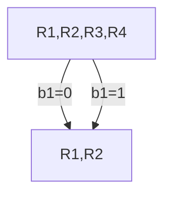
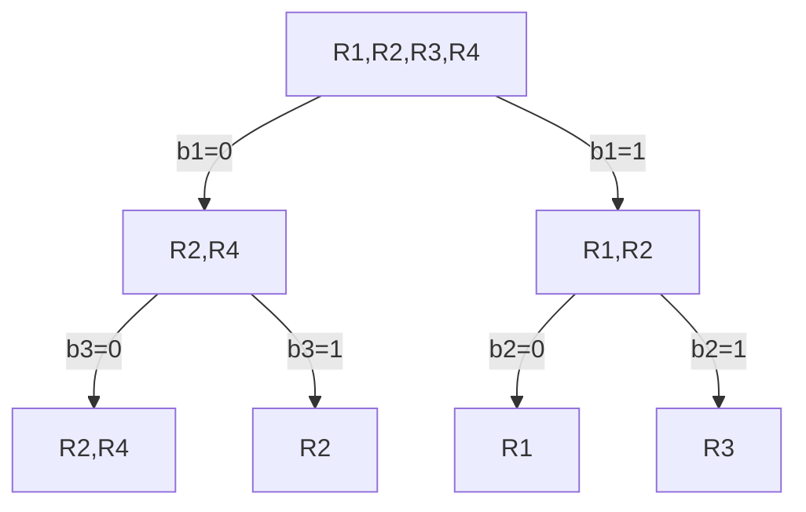

# Decision-trees
**First assignement in course Machine Learning 2021B at BGU**  :sparkles:

## Formulas

> * Entropy: H(X) = - Σx P(X=x) log<sub>2</sub>(P(X=x))
> * Conditional Entropy: H(Y | X) = Σx P(X = x) H(Y | X = x)
> * Information Gain: IG (Y, X) = H(Y) - H(Y | X)

For entropy, the smaller the better (big entropy -> big uncertainty). For IG, the higher the better. 
> H(x) = 0 -> no uncertainty

## Remove Column from matrix
Remove 2nd column of random matrix of dimensions 6x4 &rarr; result dimensions: 6x3 
```Mathematica
(m = RandomInteger[9, {6, 4}]) // MatrixForm
Drop[m, None, {2}] // MatrixForm
```

## Entropy with don't cares
If we have a don't care bit, we need to "duplicate" the rule to include both cases. 
> To calculate the entropy we take the probability with 2^(# of don't cares)

### MyEntropy[list]
Replace the native one in mathematica by taking don't care (**-1**) into account
```Mathematica
MyEntropy[li_List] :=
 Module[{list = li, tot, prob, H},
  tot = 2^Count[-1] /@ list ;
  prob = (tot/(Total@tot)) // N;
  H = -Sum[prob[[i]] log2[prob[[i]]], {i, Length[list]}] // N
  ]
```

### CondEntropy[list, index]
Calculate the conditional entropy of the **_list_** for a specific bit (**_index_**)
```mathematica
CondEntropy[li_List, ind_Integer] :=
 Module[{list = li, i = ind, c0, c1, H},
  c0 = Drop[#, None, {i}] &@Select[rules, #[[i]] != 1  &];
  c1 = Drop[#, None, {i}] &@Select[rules, #[[i]] != 0 &];
  H = ((Length[c0]/Length[list]) MyEntropy[
        c0] + (Length[c1]/Length[list]) MyEntropy[c1]) // N
  ]
```

### FindBestChoice[list]
For a given **_list_** return the best index to pick top maximize the **IG**
```Mathematica
FindBestChoice[li_List] :=
 Module[{list = li, tot, prob, H, condEntropy, IG, bestCond},
  H = MyEntropy[list];
  allEntropy = Table[CondEntropy[list, i], {i, 2, Length[list[[1]]]}];
  IG = H - # &@allEntropy;
  bestCond = Part[#, 1] &@Flatten@Position[IG, Max[IG]]
  ]
```

## Information Gain - IG
Let's find the analitycal expression of IG(R<sub>i</sub>,b<sub>j</sub>):


> IG(R<sub>i</sub>,b<sub>j</sub>) = H(R<sub>i</sub>) - H(R<sub>i</sub> | b<sub>j</sub>)  
> H(R<sub>i</sub> | b<sub>j</sub>) = P(b<sub>j</sub> = 0) \* H(R<sub>i</sub> | b<sub>j</sub> = 0) + P(b<sub>j</sub> = 1) \* H(R<sub>i</sub> | b<sub>j</sub> = 1)  
> H(R<sub>i</sub> | b<sub>j</sub> = 1) = 


## Evaluate timing of a function
```Mathematica
timeIt::usage = 
  "timeIt[expr] gives the time taken to execute expr,   repeating as \
many times as necessary to achieve a total time of 1s";

SetAttributes[timeIt, HoldAll]
timeIt[expr_] := 
 Module[{t = Timing[expr;][[1]], tries = 1}, 
  While[t < 1., tries *= 2; t = Timing[Do[expr, {tries}];][[1]];];
  t/tries]
```

# Example

Rules| b<sub>1</sub> | b<sub>2</sub> | b<sub>3</sub> | b<sub>4</sub>
-- | - | - | -- | -
R<sub>1</sub> | 1 | 0 | \* | \* 
R<sub>2</sub> | 0 | 1 | \* | \* 
R<sub>3</sub> | 1 | 1 | 0  | \*
R<sub>4</sub> | 0 | 1 | 0  | 0 

> Every * (don't care) duplicate the rule &rarr; R<sub>1</sub> & R<sub>2</sub> appear 4 times, R<sub>3</sub> twice and R<sub>4</sub> only once.
> In total it is like there are 11 rules

```Mathematica
H(Rule) = -(4/11 log2[4/11] + 4/11 log2[4/11] + 2/11 log2[2/11] + 1/11 log2[1/11]) = 1.82307
```

#### Conditional Entropy given b<sub>1</sub>
```Mathematica
H(Rule | b1=0) = - (4/5 log2[4/5] + 1/5 log2[1/5]) = 0.721928
H(Rule | b1=1) = - (4/6 log2[4/6] + 2/6 log2[1/6]) = 1.25163
H(Rule | b1) = 1/2 H(Rule | b1=0) + 1/2 H(Rule | b1=1) = 0.986779
IG(Rule, b1) = H(rule) - H(Rule | b1) = 0.836289
```

#### Conditional Entropy given b<sub>2</sub>
```Mathematica
H(Rule | b2=0) = - log2[1] = 0
H(Rule | b2=1) = - (4/7 log2[4/7] + 2/7 log2[2/7] + 1/7 log2[1/7]) = 1.37878
H(Rule | b2) = 1/4 H(Rule | b2=0) + 3/4 H(Rule | b2=1) = 1.03409
IG(Rule, b2) = H(rule) - H(Rule | b2) = 0.78898
```

#### Conditional Entropy given b<sub>3</sub>
```Mathematica
H(Rule | b3=0) = - (2/7 log2[2/7] + 2/7 log2[2/7] + 2/7 log2[2/7] + 1/7 log2[1/7]) = 1.95021
H(Rule | b3=1) = - (2/4 log2[2/4] + 2/4 log2[2/4]) = 1
H(Rule | b3) = 1/2 H(Rule | b3=0) + 1/2 H(Rule | b3=1) = 1.63347
IG(Rule, b3) = H(rule) - H(Rule | b3) = 0.189593
```

#### Conditional Entropy given b<sub>4</sub>
```Mathematica
H(Rule | b4=0) = - (2/6 log2[2/6] + 2/6 log2[2/6] + 1/6 log2[1/6] + 1/6 log2[1/6]) = 1.9183
H(Rule | b4=1) = - (2/5 log2[2/5] + 2/5 log2[2/5] + 1/5 log2[1/5]) = 1.52193
H(Rule | b4) = 4/7 H(Rule | b1=0) + 3/7 H(Rule | b1=1) = 1.74842
IG(Rule, b4) = H(rule) - H(Rule | b1) = 0.074644
```

> The best pick is the one with the highest Information Gain (IG) &rarr; b<sub>1</sub>


<details>
<summary>See code [Mermaid](https://mermaid-js.github.io/mermaid/#/flowchart?id=flowcharts-basic-syntax)</summary>

</details>

## Second Iteration (left)

Rules| b<sub>2</sub> | b<sub>3</sub> | b<sub>4</sub>
-- | - | -- | -
R<sub>2</sub> | 1 | \* | \* 
R<sub>4</sub> | 1 | 0  | 0 

```Mathematica
H(Rule) = -(4/5 log2[4/5] + 1/5 log2[1/5]) = 0.721928
```

#### Conditional Entropy given b<sub>2</sub>
```Mathematica
H(Rule | b2=0) = 0
H(Rule | b2=1) = - (4/5 log2[4/5] + 1/5 log2[1/5]) = 0.721928
H(Rule | b2) = 0.721928
IG(Rule, b2) = H(rule) - H(Rule | b2) = 0
```

#### Conditional Entropy given b<sub>3</sub> or b<sub>4</sub>
```Mathematica
H(Rule | b3=0) = - (2/3 log2[2/3] + 1/3 log2[1/3]) = 0.918296
H(Rule | b3=1) = 0
H(Rule | b3) = 2/3 H(Rule | b3=0) = 0.612197
IG(Rule, b3) = H(rule) - H(Rule | b3) = 0.109731
```

## Second Iteration (rigth)

Rules| b<sub>2</sub> | b<sub>3</sub> | b<sub>4</sub>
-- | - | -- | -
R<sub>1</sub> | 0 | \* | \* 
R<sub>3</sub> | 1 | 0  | \*

```Mathematica
H(Rule) = -(4/5 log2[4/5] + 1/5 log2[1/5]) = 0.721928
```

#### Conditional Entropy given b<sub>2</sub>
```Mathematica
H(Rule | b2=0) = 0
H(Rule | b2=1) = 0
H(Rule | b2) = 0
IG(Rule, b2) = H(rule) - H(Rule | b2) = 0.721928
```

#### Conditional Entropy given b<sub>3</sub>
```Mathematica
H(Rule | b3=0) = - (2/3 log2[2/3] + 1/3 log2[1/3]) = 0.918296
H(Rule | b3=1) = 0
H(Rule | b3) = 2/3 H(Rule | b3=0) = 0.612197
IG(Rule, b3) = H(rule) - H(Rule | b3) = 0.109731
```

#### Conditional Entropy given b<sub>4</sub>
```Mathematica
H(Rule | b3=0) = - (2/3 log2[2/3] + 1/3 log2[1/3]) = 0.918296
H(Rule | b3=1) = - (2/3 log2[2/3] + 1/3 log2[1/3]) = 0.918296
H(Rule | b3) = 0.918296
IG(Rule, b3) = H(rule) - H(Rule | b3) = -0.196368
```

> Finaly we get: 


<details>
<summary>See code [Mermaid](https://mermaid-js.github.io/mermaid/#/flowchart?id=flowcharts-basic-syntax)</summary>

</details>
